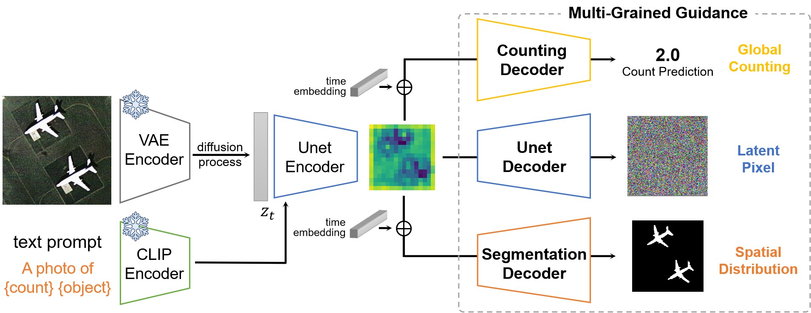
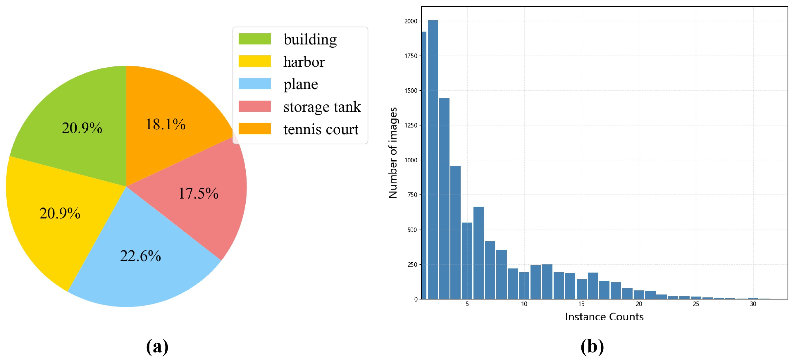
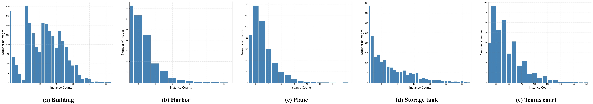

 <h1>
  <a href="https://xxx">Multi-Grained Guided Diffusion for Quantity-Controlled Remote Sensing Object Generation</a>
</h1>

**[Zhiping Yu](https://scholar.google.com.tw/citations?user=qgldqJAAAAAJ&hl=en),[Chenyang Liu](https://chen-yang-liu.github.io/), Chuyu Zhong, [Zhengxia Zou](https://scholar.google.com.hk/citations?hl=en&user=DzwoyZsAAAAJ), and [Zhenwei Shi*✉](https://scholar.google.com.hk/citations?hl=en&user=kNhFWQIAAAAJ)**

## Share us a :star: if you're interested in this repo

- Official repository of the paper: "**Multi-Grained Guided Diffusion for Quantity-Controlled Remote Sensing Object Generation**" 
- The dataset and model will be publicly available here.
## Latest Updates
- 2025-04-18: The test set of the Levir-QCG dataset is **available**.

## Multi-Grained Guided Diffusion Model
- In this paper, we explore a novel task, quantity-controlled remote sensing object generation, and propose a novel model, **Multi-Grained Guided Diffusion** (MGDiff). The MGDiff imposes constraints not only on latent space noise prediction, but also on high-level semantic features of object instances at both global counting and spatial distribution granularities, establishing training guidance across three distinct grained levels. 
 

  

 

The counting branch provides global-granularity quantity guidance and the segmentation branch provides spatial-granularity distribution guidance. After training, the counting and segmentation branches **can be removed** during the object generation.

## Levir-QCG Dataset
- The Levir-QCG dataset contains remote sensing images annotated with precise instance quantity and pixel-wise object masks. The dataset contains images covering 5 object types: building, harbor, plane, storage tank, and tennis court.

  

  

The test set is available now. It can be downloaded by [Baidu Drive](https://pan.baidu.com/s/1Esteen3FSvDoFCXwi5-A6Q). Extraction code: k6fy

We will provide the download link for the entire dataset as soon as the paper has been officially published.

## License

This repo is distributed under [MIT License](https://github.com/Chen-Yang-Liu/Change-Agent/blob/main/LICENSE.txt). The code can be used for academic purposes only.

[//]: # (## Contact Us)

[//]: # (If you have any other questions❓, please contact us in time 👬)
